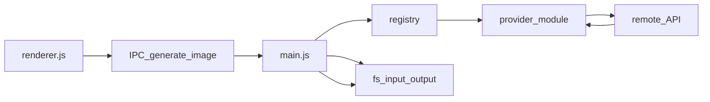

# Image generation — agent reference

Dense facts for this Electron app. No tutorial prose.

## Module map

| Role | Path |
|------|------|
| IPC orchestration | [`main.js`](main.js) `generate-image` handler |
| Provider registry | [`providers/registry.js`](providers/registry.js) — `getProvider`, `listProviders`, `listUniqueVendors`, `isValidProviderId`, `DEFAULT_ID`, `normalizeProviderId`, `LEGACY_GEMINI_ID` |
| Google AI Studio (direct) | [`providers/ai_studio_nano_banana_pro.js`](providers/ai_studio_nano_banana_pro.js) — model `gemini-3-pro-image-preview`, `GEMINI_API_KEY`, `vendor: ai_studio` |
| Kie.ai market API | [`providers/kie_nano_banana_pro.js`](providers/kie_nano_banana_pro.js) — model `nano-banana-pro`, `KIE_AI_API_KEY`, `vendor: kie_ai` |
| Kie reference uploads + cache | [`lib/kieReferenceUpload.js`](lib/kieReferenceUpload.js) — `uploadReferenceImages` (globally serialized across concurrent Kie jobs) |
| Vendor job limits (concurrency + rate) | [`lib/vendorJobGate.js`](lib/vendorJobGate.js) — `withVendorJobGate` |
| Default / merge vendor limit rows | [`lib/vendorLimitsDefaults.js`](lib/vendorLimitsDefaults.js) — `mergeVendorJobLimits`, `clampVendorLimitEntry` |
| Kie URL cache (SQLite) | [`lib/kieUploadCacheSqlite.js`](lib/kieUploadCacheSqlite.js) — `KieUploadCacheSqlite` |
| Reference files → Gemini parts | [`lib/referenceParts.js`](lib/referenceParts.js) — `buildGeminiContents`, `loadReferenceInlineParts` |
| PNG tEXt injection | [`lib/pngMetadata.js`](lib/pngMetadata.js) — `injectPngMetadata` |
| PNG/JPEG normalize, metadata, write | [`lib/imagePipeline.js`](lib/imagePipeline.js) — `finalizeAndSaveImage` |

## Provider IDs and `vendor`

| `id` | `vendor` | Backend |
|------|----------|---------|
| `ai_studio_nano_banana_pro` | `ai_studio` | `@google/genai` → `gemini-3-pro-image-preview` |
| `kie_nano_banana_pro` | `kie_ai` | Kie jobs API + file upload host |

- **`listProviders()`** returns `{ id, label, vendor }` for each entry.
- **`provider` id** (model-level) is stored in PNG `BananaAppMeta` for restore.
- **Kie upload cache** keys use **`vendor`** (`kie_ai`) + **api key hash** + **content hash** so future Kie models can share the same SQLite rows.

**Legacy**: `config.json` or metadata value `gemini` is normalized to `ai_studio_nano_banana_pro` ([`registry.js`](providers/registry.js) `normalizeProviderId`).

## Kie reference uploads

- **Module**: [`lib/kieReferenceUpload.js`](lib/kieReferenceUpload.js).
- **Size rule**: `fileSize ≤ 4 MiB` → `POST .../file-base64-upload` (JSON + data URL). Larger files → `POST .../file-stream-upload` with **multipart** (`FormData` + `Blob` buffer in memory, not streaming readers).
- **Host**: `https://kieai.redpandaai.co` (upload), `https://api.kie.ai` (jobs).

## Kie upload cache (SQLite)

- **Path**: `path.join(app.getPath('userData'), 'kie-upload-cache.sqlite')` — opened lazily in [`main.js`](main.js) via `getKieUploadCache()` when `provider.vendor === 'kie_ai'`.
- **Schema**: composite PK `(vendor, api_key_hash, content_hash)`; columns `url`, `expires_at_ms`, `created_at_ms`.
- **TTL**: Prefer `expiresAt` from Kie upload JSON when parseable; else default **2.5 days**. Entries are not reused within **1 hour** of recorded expiry (`SAFETY_BUFFER_MS` in [`kieUploadCacheSqlite.js`](lib/kieUploadCacheSqlite.js)).
- **Prune**: `pruneExpired()` runs at the start of each `uploadReferenceImages` batch.
- **Dedupe**: in-flight `Map` in [`kieReferenceUpload.js`](lib/kieReferenceUpload.js) so parallel jobs share one upload per `(vendor, apiKeyHash, contentHash)`.
- **Serialization**: a module-level promise chain ensures **only one** `uploadReferenceImages` batch runs at a time (Kie cache workaround).
- **Native module**: `better-sqlite3` must match Electron’s Node ABI. After `npm install`, run **`npm run rebuild:sqlite`** from the app root (uses `@electron/rebuild`).

## Runtime

- **Where API runs**: Electron **main** only. [`main.js`](main.js) `ipcMain.handle('generate-image', …)`.
- **Trigger**: [`renderer.js`](renderer.js) `ipcRenderer.invoke('generate-image', payload)`.
- **WebPreferences**: `nodeIntegration: true`, `contextIsolation: false` — [`main.js`](main.js).

## Provider selection

- **Order**: payload `provider` → `process.env.IMAGE_PROVIDER` → `config.json` `imageProvider` → registry `DEFAULT_ID` (`ai_studio_nano_banana_pro`).
- **Settings IPC**: [`get-settings`](main.js) returns normalized `imageProvider`, `availableProviders`, **`vendorJobLimits`** (merged with defaults per `listUniqueVendors()`). [`save-settings`](main.js) accepts `imageProvider`, `apiKey`, `kieApiKey`, **`vendorJobLimits`** (per-vendor rows), `debugMode`, etc.
- **Settings UI** ([`index.html`](index.html) / [`renderer.js`](renderer.js)): three tabs — **API keys**, **Request limits** (per vendor: max concurrent, max starts per window, window seconds, poll interval ms), **App** (debug mode).
- **config.json** `vendorJobLimits`: map `vendor` string → `{ maxConcurrent, maxStartsPerWindow, windowMs, pollIntervalMs }`. Defaults in [`lib/vendorLimitsDefaults.js`](lib/vendorLimitsDefaults.js) (Kie: 100 concurrent, 20 starts / 10s; AI Studio: 50 concurrent, 60 starts / 60s).

## Secrets and env

- **AI Studio**: `process.env.GEMINI_API_KEY` (`dotenv` + Settings).
- **Kie.ai**: `process.env.KIE_AI_API_KEY`.
- **Missing keys**: AI Studio → `API Key is missing in .env file`; Kie → `Kie.ai API key is missing (set KIE_AI_API_KEY in .env or Settings)`.

## Network

- **AI Studio HTTP timeout**: `600000` ms — [`providers/ai_studio_nano_banana_pro.js`](providers/ai_studio_nano_banana_pro.js).
- **Kie**: poll loop up to **600000** ms; **delay** between `recordInfo` polls from Settings **`pollIntervalMs`** for `kie_ai` — [`providers/kie_nano_banana_pro.js`](providers/kie_nano_banana_pro.js).
- **Vendor job gate**: every `generate-image` runs inside [`withVendorJobGate`](lib/vendorJobGate.js) keyed by `provider.vendor` (concurrency + sliding-window start rate from merged `vendorJobLimits`).

## Provider contract

Each provider exports `buildRequestParts`, `generateImage`, `id`, `label`, **`vendor`**. [`main.js`](main.js) calls:

```js
generateImage({
  apiKey,
  vendor,           // from provider.vendor
  kieUploadCache,   // KieUploadCacheSqlite | null (only for vendor kie_ai)
  prompt,
  resolution,
  ratio,
  parts,
  inputDir,
  referenceImages,
  logger,
  sendDebug,
  sendRequestLog,   // optional → request-log IPC
  pollIntervalMs    // optional; Kie uses for recordInfo spacing
})
```

## IPC: `generate-image`

### Payload

| field | notes |
|--------|--------|
| `prompt` | string |
| `resolution` | `1K` / `2K` / `4K` (Kie maps invalid → `1K`) |
| `ratio` | aspect string (Kie uses listed enums; unknown → `1:1`) |
| `referenceImages` | `[{ hash, mimeType, extension? }, …]` (Kie max 8) |
| `project` | title or `null` |
| `provider` | optional; legacy `gemini` accepted via `getProvider` |

### Response

- `{ success: true, path }` or `{ success: false, error, kieTaskId? }`. **`kieTaskId`** is set when Kie’s **poll loop times out** after `createTask` so the UI can offer a one-shot **🔄** retry ([`kie-recover-task`](#ipc-kie-recover-task)).

## IPC: `kie-recover-task`

- **Payload**: `taskId`, `prompt`, `resolution`, `ratio`, `referenceImages`, `project` (same shape as generate for metadata).
- **Behavior**: **Exactly one** `recordInfo` call. If task **success** → download result URL, `finalizeAndSaveImage`, `{ success: true, path }`. If **fail** → `{ success: false, error }`. If still running / no final image → `{ success: false, stillPending: true }`.
- **Gate**: uses the same **`kie_ai`** vendor job gate as `generate-image`.

## Saved metadata (`BananaAppMeta`)

- JSON (base64 in PNG tEXt): `prompt`, `resolution`, `ratio`, `provider`, `referenceImages`.
- **Restore** ([`renderer.js`](renderer.js) `restoreContext`): missing `provider` or `provider === 'gemini'` → treat as `ai_studio_nano_banana_pro`.

## Debug channel

- `sendDebug(label, data)` → `debug-log` IPC.

## Do not assume

1. Kie `image_input` requires hosted URLs; refs are uploaded via Kie (base64 or stream) first; URLs may be cached in SQLite under `userData`.
2. **`google api snippet.ts`** uses a role wrapper; AI Studio provider uses a flat Gemini `contents` array.

## Flow (mermaid)


